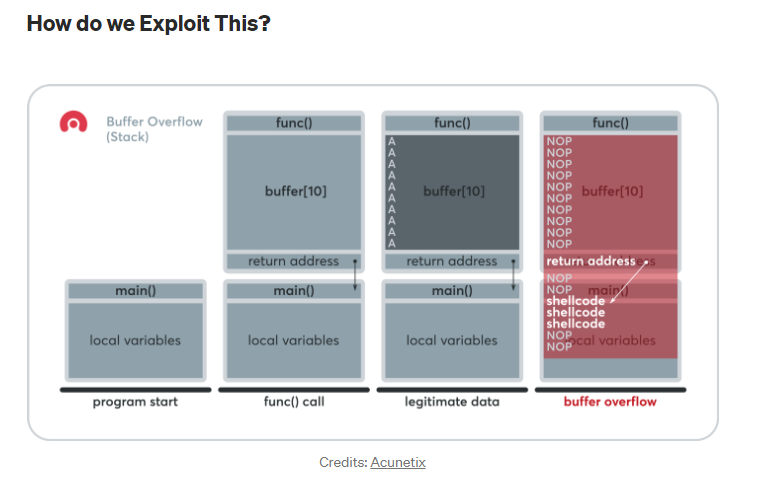

# BOF T3erminology to Understand

Resources:
- https://sghosh2402.medium.com/understanding-exploiting-stack-based-buffer-overflows-acf9b8659cba 
- https://www.tutorialspoint.com/how-does-a-process-look-like-in-memory

## Buffers
- Memory space that is allocated by the OS to allow a program to run

## Threads
- A thread is a sequential flow of control within a program
- Typically people talk about threads when there are multiple threads running at the same time and performing different tasks within a single program

## Stacks
- The stacks is a piece of process memory (aka a program loaded into memory and executed)
    - https://www.tutorialspoint.com/how-does-a-process-look-like-in-memory
- A Stack gets allocated by the OS for each thread
- When the thread ends the stack is cleared as well
- **The size of the stack is defined when it is created and doesn't change**

## Stack Frame
- A **stack frame** is a frame of data that gets pushed onto the stack. 
- 

## Registers

What is a register? 
- A register is a storage component on a CPU that is used to temporarily store data. There are a variety of different registers in a CPU that hold various types of information. 

What are some examples of Registers? See below:

1. **EAX Accumulator**: Arithmetical and Logical instructions are stored here. 
2. **EBX (base)**: Base pointer for memory addresses

- Registers that start with "e" are 32 bits wide and those that start with "r" are 64 bits wide. 

- Info: https://www.tutorialspoint.com/assembly_programming/assembly_registers.htm

## Pointers: ESP, EBP, and EIP

1. **ESP: The Stack Pointer**: 
- During a thread's execution, the stack is constantly in flux which can make it difficult for a function to locate its own stack frame. This is where the **Stack Pointer** comes into play. 
- Stack frame components:
    - A stack frame is comprised of:
        - Local variables
        - Saved copies of registers modified by subprograms that could need restoration
        - Argument parameters 
        - Return address
- The Stack Pointer (ESP) keeps track of the ***most recently referenced*** location on the stack (aka the top of the stack) by storing a pointer to it. 

2. **EBP: The Base Pointer**:
- As goes for the Stack Pointer, the Base Pointer (EBP) is used for a function to locate its own stack frame (where all the parameters, variables, and the function return address are stored for a program) 
- The EBP Storeds a pointer to the top of the stack when a function is called. 

3. **EIP: The Instruction Pointer**:
- One of the most important registers for our purposes in creating and executing BOFs
- The **Instruction Pointer (EIP)** points to the next code instruction to be executed. 
- The EIP directs the flow of a program and so if an attacker can control the EIP, they can direct the EIP to run code that normally wouldn't run. 
- THE EIP IS THE MAIN TARGET FOR ATTACKERS WHEN EXPLOITING A MEMORY CORRUPTION VULNERABILITY. 

## Offsets

## Offsets

## Buffer Overflow Overview:
