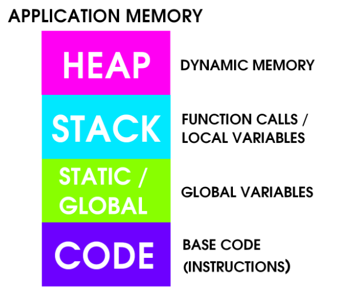

# The Great Wide World of Buffer Overflows

Good Beginner Resources:
- https://d0nut.medium.com/week-13-introduction-to-buffer-overflows-5f15c0d5b5c1

Definition: A **Buffer Overflow** is a type of memory corruption vulnerability. 

Buffer Overflows are one of the most dangerous tools in an attacker's arsenal. Understanding how to execute a Buffer Overflow attack will set you apart from other attackers in that you'll have an in depth understanding of exactly how various program's operate which will make you exceedingly dangerous in a penetration test or CTF activity. 

Before we get started on explaining Buffer Overflows, it is good to understand that Buffer Overflows are very difficult to understnad, and if you are a newbie, you will likely be very confused. But that's why we're all here. We want to learn. We want to understand. 

Here's some terminology we should get familiar with prior to jumping in (or jump in right away and come back after you've doubly confused yourself. Your choice.)

1. [Stack Buffer](#buffer)
2. EIP Register
3. [Program Memory](#program-memory)
4. System Architecture
5. CPU
6. Assembly
7. Bounds Checking
8. x86 Architecture

### Buffer
So what the hell even is a buffer anyway?
- A buffer is a memory place or location which is used by a running program
- This memory location is used to store some temporary data thjat is being used by the program
 
For example:
If we have a program that takes a name as input and outputs it to the screen, and we type the name "Tom" as input, the word "Tom" would be stored in the buffer until the program executes the print command. 

So basically a **buffer is a location in the computers memory where information is temporarily stored**. 

Something to make you think about a real life analogy to what happens in a Buffer Overflow: 
 
Think about if a friend of yours is carrying a big ol pot. And you happen to have a hose. The pot can hold a finite amount of water (think of this as a memory bound). If you overfill the pot, water begins to start leaking out. This analogy highlights what can happen with a buffer overflow. If your friend is too nice and doesn't set any boundaries you could keep filling the pot until the overflow fills the entire apartment you're standing in (A Denial of Service). Or it could cause your friend to drop the pot and do something they didn't intend to do (Break something).

## What is EIP (Extended Instruction Pointer)?

EIP: Called the Extended Instruction Pointer is the address of the NEXT INSTRUCTION TO EXECUTE. It is a special register in the CPU. 

### Program Memory

Memory for programs are stored in a variety of locations outlined below: 

Thank you to 0xrick for the nice graphic: https://0xrick.github.io/binary-exploitation/bof1/

Application Memory Terms to Learn:

1. Heap (Dynamic Memory): Memory is allocated at runtime for where the program will be executed.
2. Stack Memory (Function Calls/ Local Variables)
    - https://www.geeksforgeeks.org/stack-vs-heap-memory-allocation/
3. Static/ Global Memory (Global Variables): 
4. Code (Instructions/ Base Code)

When a binary application is executed it allocates memoru in a very specific way within the memory boundaries used by modern computers. 

Memory boundaries for Windows computers is between (0x00000000) and (0x7FFFFFFF)

When a thread is run it needs an area of memory for functions, local variables, and program control nformation known as the **stack**

Each htread in a running application has its own stack. Stack memory is viewed by the CPU as a LIFO Strcture. 

**LIFO**: Last in First Out

When accessing the stack, items put ("pushed") on the top of the stack are removed ("popped") first. 

In particular the x86 Architecture implements dedicated PUSH and POP assembly instructions in order to add or remove data to the stack respectively.

### Function Returns

When code runs, it must know the location of the function in memory and most importantly which address to return to **when the function completes.** This return address is stored on the stack. This is what exploit developers need to target. 

**Stack frame**: The collection of data associated with one function call stored in a section of the stack memory (it highlights the location of all functions and parameter locations.)

### Understanding CPU Registers

Resources: 
 - https://www.techtarget.com/whatis/definition/register
 - 
A CPU Register is a small set of data holding places that are a part of a computer processor. It may hold:
- An Instruction
- A storage address
- Or any kind of data (bit sequence or individual characters)

A register must be large enough to hold an instruction. This is where the architecture of computers comes in to play. For Example:

A 64-Bit Computer must have registers that are 64 bits in length

### x86 Architecture

1. Program Memory: Essentially this is where data pertaining to a particular program is stored. 
2. The Stack: Where functions, local variables, and program control information is stored (how code should be run.)

