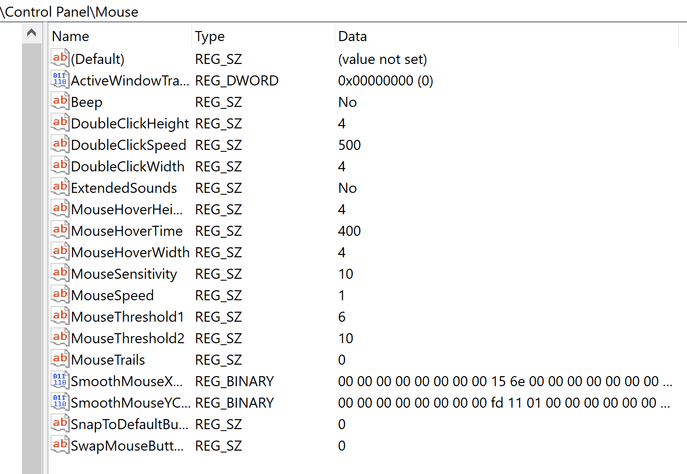

# The Windows Registry: An Attacker's Best Friend
Resources:
- https://www.avast.com/c-windows-registry#:~:text=The%20Windows%20registry%20is%20a,all%20use%20the%20Windows%20registry.
- https://www.hackingarticles.in/windows-privilege-escalation-weak-registry-permission/ 

## What is the Windows Registry?
- The **Windows Registry** is a system-defined DB where applications and system components store and retrieve configuration data
- The registry is a sensitive program and incorrectly tampering with it can cause major changes to your computer and possibly even ruin it.
- Not all applciations use the registry. Some apps use other types of configuration files or executables. If you don't properly uninstall an app their settings can still exist in the registry

## How does the Windows Registry work?

Before we get into exactly how it works, it's important to cover some terminology:

1. **Registry Keys**: Think of them like folders that contain values or subkeys within them. 
- An example of the registry settings set for the mouse on a laptop:
        
2. **Registry Values**: Similar to files. Are stored within Registry Keys
3. **Registry Hives**: The main branches of the windows registry are called **hives**. The hives in the Windows registry have the following names:
    - **HKEY_CLASSES_ROOT**
        - Keeps track of default file associations (How your computer knows to open a word.doc file)
    - **HKEY_CURRENT_USER**
        - Contains settings specific to your username in Windows
    - **HKEY_LOCAL_MACHINE** (POSSIBLY MOST IMPORTANT HIVE IN THE REGISTRY)
        - Contains passwords, boot files, software installation files, software installation files, and security settings
        - Abbreviated HKLM 
    - **HKEY_USERS**
        - Same as HKEY_CURRENT_USER except if there are more than one user on a server or computer
    - **HKEY_CURRENT_CONFIG**
        - A real-time measurement of different hardware activities. information in this hive isn't save permanently to the registry. 

## Basic Registry Exploitation

With all of this information in mind, how can an attacker exploit this system for malicious purposes. Below highlight a few examples:

1. Using Registry Keys to push Malware Attacks
2. Using "Run Keys" and the Windows Startup folder to establish persistence
    - The attacker sneaks 

